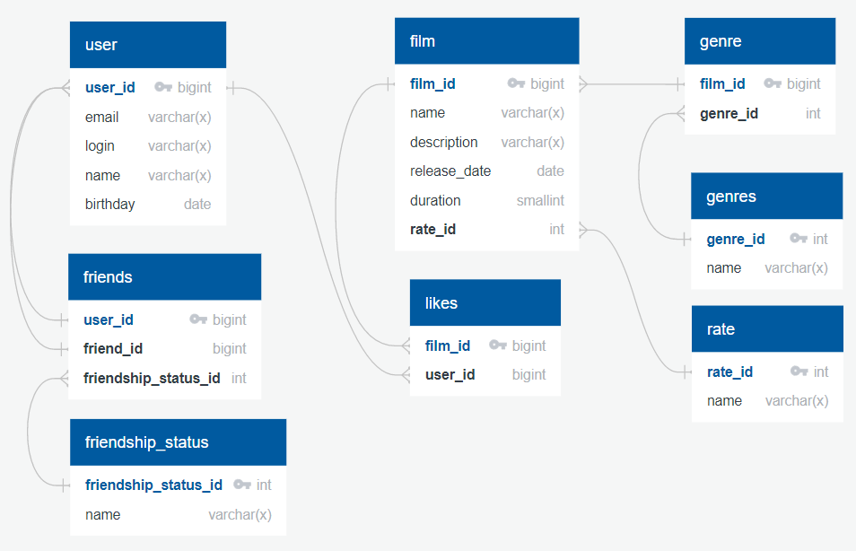

# java-filmorate

Примеры основных запросов:

Операции с фильмами - {{baseUrl}}/films

 - добавление фильма - POST 

    body:
    {
   "name": "labore nulla",
   "releaseDate": "1979-04-17",
   "description": "Duis in consequat esse",
   "duration": 100,
   "rate": 4
   }

 - обновление фильма - PUT 

    body:
{
"id": 1,
"name": "Film Updated",
"releaseDate": "1989-04-17",
"description": "New film update decription",
"duration": 190,
"rate": 4
}

 - получение всех фильмов - GET
 - получить фильм по его идентификатору - GET
   {{baseUrl}}/films/{id}
 - пользователь ставит лайк фильму - PUT {{baseUrl}}/films/{id}/like/{userId}
 - пользователь удаляет лайк - DELETE {{baseUrl}}/films/{id}/like/{userId}
 - получить список из первых count фильмов по количеству лайков. Если значение параметра count не задано, то по умолчанию вернутся первые 10 - GET {{baseUrl}}/films/popular?count={count} 

Операции с пользователями - {{baseUrl}}/users

- создание пользователя - POST 

    body:
  {
  "login": "dolore",
  "name": "Nick Name",
  "email": "mail@mail.ru",
  "birthday": "1946-08-20"
  }
- обновление пользователя - PUT

    body:
{
"login": "doloreUpdate",
"name": "est adipisicing",
"id": 1,
"email": "mail@yandex.ru",
"birthday": "1976-09-20"
}
- получение списка всех пользователей - GET
- получить пользователя по его идентификатору - GET
     {{baseUrl}}/users/{id}
- добавление пользователя в друзья - PUT {{baseUrl}}/users/{id}/friends/{friendId}
- удаление из друзей - DELETE {{baseUrl}}/users/{id}/friends/{friendId}
- получение списка пользователей, являющихся друзьями подбзователя - GET {{baseUrl}}/users/{id}/friends
- получение списка друзей, общих с другим пользователем - GET {{baseUrl}}/users/{id}/friends/common/{otherId}

Схема базы данных:

